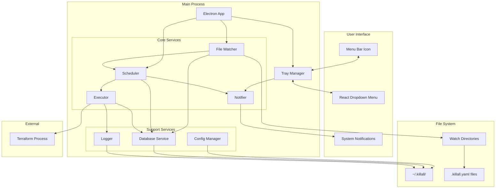
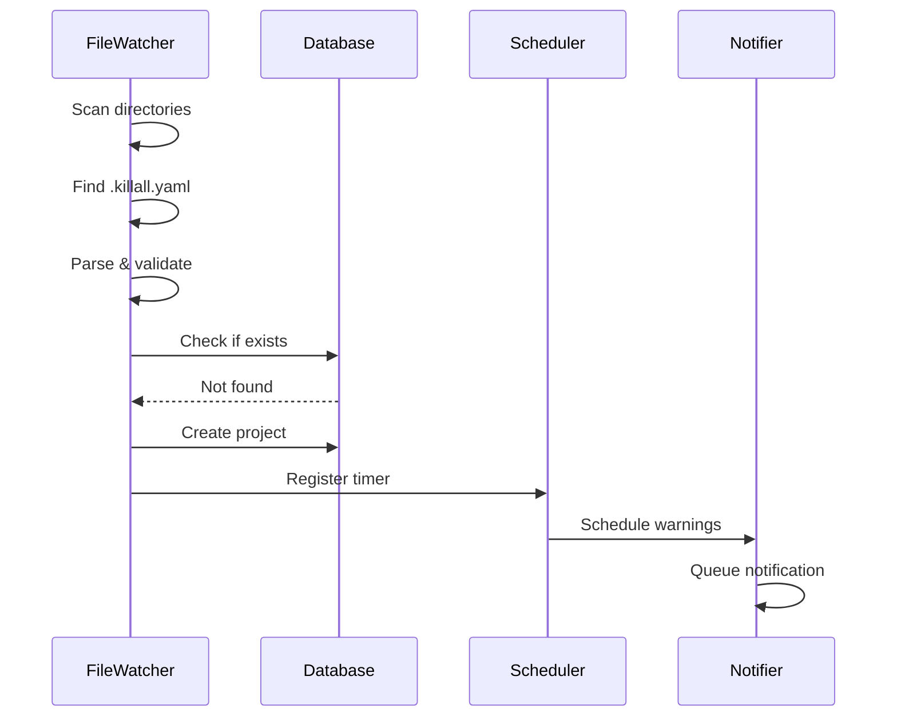
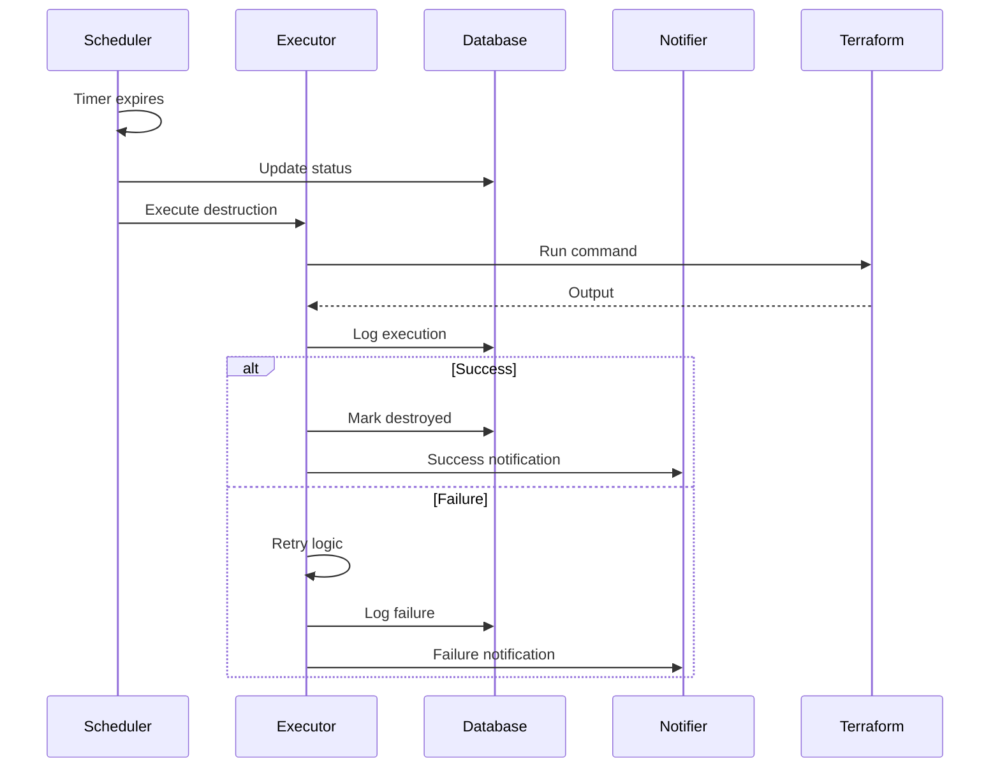

# Killall-Tofu Architecture

## System Overview

Killall-Tofu is built as an Electron application with a clear separation between the main process (backend services) and renderer process (UI). The architecture follows functional programming principles with immutable state management and pure functions wherever possible.

## Implementation Status

**Phase 1 Complete (Foundation)**
- ✅ Electron application structure with TypeScript
- ✅ Menu bar tray icon and window management  
- ✅ Complete system design documentation
- ✅ Development standards and functional programming guidelines

**Phase 2 In Progress (Core Services)**
- 🔄 File watcher service implementation
- 🔄 Database service with SQLite integration
- 🔄 Scheduler service for timer management
- 🔄 React UI components and IPC bridge
- 🔄 System notification integration

## Core Design Principles

1. **No Global State** - All state is explicitly managed and passed
2. **Functional Paradigm** - Pure functions, immutability, composition
3. **Event-Driven** - Services communicate through events
4. **Dependency Injection** - Services receive dependencies explicitly
5. **Result Types** - Explicit error handling without exceptions

## System Architecture Diagram



## Component Architecture

### Main Process Components

#### Application Core (`src/main/app.ts`)
```typescript
interface AppCore {
  initialize(): Promise<Result<void>>;
  start(): Promise<Result<void>>;
  shutdown(): Promise<Result<void>>;
}
```
- Bootstraps the application
- Initializes all services
- Manages application lifecycle
- Handles system events

#### Tray Manager (`src/main/tray.ts`)
```typescript
interface TrayManager {
  create(): Result<void>;
  updateIcon(state: IconState): void;
  updateBadge(count: number): void;
  showMenu(): void;
  destroy(): void;
}
```
- Manages menu bar icon
- Handles icon animations (pulsing, spinning)
- Updates badge count
- Creates context menu

### Core Services

#### File Watcher Service (`src/main/services/watcher.ts`)
```typescript
interface FileWatcher {
  start(config: WatcherConfig): Promise<Result<void>>;
  stop(): Promise<void>;
  scan(): Promise<Result<ProjectConfig[]>>;
  onProjectDiscovered(handler: ProjectHandler): void;
  onProjectRemoved(handler: ProjectHandler): void;
}
```

**Responsibilities:**
- Recursively scans configured directories
- Detects `.killall.yaml` files
- Parses and validates configurations
- Emits events for project discovery/removal
- Respects ignore patterns

**Data Flow:**
```
Watch Dirs → Scan → Find .killall.yaml → Parse → Validate → Emit Event
```

#### Scheduler Service (`src/main/services/scheduler.ts`)
```typescript
interface Scheduler {
  register(project: Project): Result<void>;
  cancel(projectId: string): Result<void>;
  extend(projectId: string, duration: string): Result<void>;
  getActive(): Project[];
  onDestroy(handler: DestroyHandler): void;
  onWarning(handler: WarningHandler): void;
}
```

**Responsibilities:**
- Maintains timer registry
- Calculates destruction times
- Emits warning events
- Triggers destruction events
- Handles timer extensions/cancellations

**State Management:**
```typescript
type SchedulerState = {
  readonly timers: Map<string, Timer>;
  readonly warnings: Map<string, Set<number>>;
};
```

#### Executor Service (`src/main/services/executor.ts`)
```typescript
interface Executor {
  execute(project: Project): Promise<Result<ExecutionResult>>;
  cancel(executionId: string): Result<void>;
  getRunning(): Execution[];
  onComplete(handler: ExecutionHandler): void;
  onFailed(handler: ExecutionHandler): void;
}
```

**Responsibilities:**
- Spawns terraform processes
- Captures stdout/stderr
- Implements retry logic
- Manages concurrent executions
- Handles timeouts

**Execution Pipeline:**
```
Pre-hooks → Main Command → Post-hooks → Cleanup
     ↓            ↓             ↓          ↓
   Retry       Retry         Retry    Log Results
```

#### Notifier Service (`src/main/services/notifier.ts`)
```typescript
interface Notifier {
  notify(notification: Notification): Result<void>;
  scheduleWarning(project: Project, time: number): void;
  cancelWarnings(projectId: string): void;
  playSound(sound: SoundType): void;
}
```

**Responsibilities:**
- System notifications
- Warning scheduling
- Sound alerts
- Notification queuing

### Support Services

#### Config Manager (`src/main/config/manager.ts`)
```typescript
interface ConfigManager {
  load(): Promise<Result<Config>>;
  save(config: Config): Promise<Result<void>>;
  validate(config: unknown): Result<Config>;
  getWatchDirs(): string[];
  getIgnorePatterns(): string[];
}
```

**Configuration Hierarchy:**
1. Default configuration (built-in)
2. Global configuration (`~/.killall/killall.yaml`)
3. Project configuration (`.killall.yaml`)

#### Database Service (`src/main/database/index.ts`)
```typescript
interface Database {
  connect(): Promise<Result<void>>;
  disconnect(): Promise<Result<void>>;
  transaction<T>(fn: TransactionFn<T>): Promise<Result<T>>;
  
  projects: ProjectRepository;
  executions: ExecutionRepository;
  events: EventRepository;
}
```

**Schema Management:**
- Automatic migrations on startup
- Schema versioning
- Backup before migrations
- Rollback on failure

#### Logger Service (`src/main/utils/logger.ts`)
```typescript
interface Logger {
  debug(message: string, meta?: object): void;
  info(message: string, meta?: object): void;
  warn(message: string, meta?: object): void;
  error(message: string, error?: Error, meta?: object): void;
}
```

**Log Rotation:**
- Size-based rotation (10MB default)
- Compression of archived logs
- Automatic cleanup of old logs

### Renderer Process Components

#### React Application (`src/renderer/App.tsx`)
```typescript
const App: FC = () => {
  const projects = useProjects();
  const recent = useRecentActivity();
  
  return (
    <MenuContainer>
      <ActiveProjects projects={projects} />
      <RecentActivity items={recent} />
      <Settings />
    </MenuContainer>
  );
};
```

#### Component Hierarchy
```
App
├── MenuContainer
│   ├── Header
│   ├── ActiveProjects
│   │   └── ProjectItem
│   │       ├── Countdown
│   │       ├── Actions
│   │       └── Tags
│   ├── RecentActivity
│   │   └── ActivityItem
│   └── Settings
│       ├── WatchDirectories
│       ├── IgnorePatterns
│       └── Notifications
└── StatusBar
```

## Data Flow

### Project Discovery Flow


### Destruction Flow


## State Management

### Application State
```typescript
type AppState = {
  readonly config: Config;
  readonly projects: Map<string, Project>;
  readonly executions: Map<string, Execution>;
  readonly ui: UIState;
};

type UIState = {
  readonly menuOpen: boolean;
  readonly activeTab: Tab;
  readonly notifications: Notification[];
};
```

### State Updates (Immutable)
```typescript
const updateProject = (
  state: AppState,
  projectId: string,
  updates: Partial<Project>
): AppState => ({
  ...state,
  projects: new Map([
    ...state.projects,
    [projectId, {
      ...state.projects.get(projectId),
      ...updates,
      updatedAt: new Date()
    }]
  ])
});
```

## Communication Patterns

### Inter-Process Communication (IPC)
```typescript
// Main → Renderer
ipcMain.handle('get-projects', async () => {
  return scheduler.getActive();
});

// Renderer → Main
const projects = await ipcRenderer.invoke('get-projects');
```

### Event System
```typescript
// Event emitter pattern with typed events
interface EventMap {
  'project:discovered': ProjectEvent;
  'project:destroyed': ProjectEvent;
  'execution:complete': ExecutionEvent;
  'warning:triggered': WarningEvent;
}

class TypedEventEmitter<T extends Record<string, any>> {
  on<K extends keyof T>(event: K, handler: (data: T[K]) => void): void;
  emit<K extends keyof T>(event: K, data: T[K]): void;
}
```

## Error Handling

### Result Type Pattern
```typescript
type Result<T, E = Error> = 
  | { ok: true; value: T }
  | { ok: false; error: E };

// Usage
const parseConfig = (content: string): Result<Config> => {
  try {
    const config = yaml.parse(content);
    return { ok: true, value: config };
  } catch (error) {
    return { ok: false, error };
  }
};

// Handling
const result = parseConfig(content);
if (result.ok) {
  // Use result.value
} else {
  // Handle result.error
}
```

### Error Recovery
```typescript
const withRetry = async <T>(
  fn: () => Promise<Result<T>>,
  options: RetryOptions
): Promise<Result<T>> => {
  for (let attempt = 1; attempt <= options.maxAttempts; attempt++) {
    const result = await fn();
    if (result.ok) return result;
    
    if (attempt < options.maxAttempts) {
      await sleep(options.delay * Math.pow(2, attempt - 1));
    }
  }
  return { ok: false, error: new Error('Max retries exceeded') };
};
```

## Performance Considerations

### Optimization Strategies

1. **File Watching**
   - Use ignore patterns to reduce scan scope
   - Implement incremental scanning
   - Cache parsed configurations
   - Debounce rapid changes

2. **Database**
   - Use prepared statements
   - Batch inserts/updates
   - Index frequently queried columns
   - Vacuum periodically

3. **UI Rendering**
   - Virtual scrolling for long lists
   - Memoize expensive computations
   - Lazy load components
   - Debounce search inputs

4. **Memory Management**
   - Clear timers on cancellation
   - Dispose event listeners
   - Limit log retention
   - Stream large outputs

### Performance Metrics
```typescript
interface PerformanceMetrics {
  scanDuration: number;      // Time to scan all directories
  projectCount: number;      // Number of active projects
  memoryUsage: number;      // Current memory usage
  cpuUsage: number;         // CPU percentage
  dbSize: number;           // Database file size
}
```

## Security Architecture

### Input Validation
```typescript
const validatePath = (path: string): Result<string> => {
  // Prevent path traversal
  if (path.includes('..')) {
    return { ok: false, error: new Error('Invalid path') };
  }
  
  // Validate absolute path
  if (!path.startsWith('/')) {
    return { ok: false, error: new Error('Must be absolute path') };
  }
  
  return { ok: true, value: path };
};
```

### Process Isolation
```typescript
const executeCommand = async (
  command: string,
  options: ExecutionOptions
): Promise<Result<ExecutionResult>> => {
  const child = spawn(command, {
    shell: false,           // No shell expansion
    env: filterEnv(process.env),  // Filtered environment
    timeout: options.timeout,
    cwd: options.workingDir,
    uid: process.getuid(),  // Run as current user
    gid: process.getgid()
  });
  
  // Handle output...
};
```

## Testing Architecture

### Test Structure
```
src/
├── main/
│   ├── services/
│   │   ├── __tests__/
│   │   │   ├── watcher.test.ts
│   │   │   ├── scheduler.test.ts
│   │   │   └── executor.test.ts
│   │   └── __mocks__/
│   │       └── database.ts
└── renderer/
    ├── components/
    │   └── __tests__/
    │       └── ProjectItem.test.tsx
    └── __mocks__/
        └── electron.ts
```

### Test Patterns
```typescript
// Unit test with mocked dependencies
describe('Scheduler', () => {
  let scheduler: Scheduler;
  let mockDatabase: jest.Mocked<Database>;
  let mockNotifier: jest.Mocked<Notifier>;
  
  beforeEach(() => {
    mockDatabase = createMockDatabase();
    mockNotifier = createMockNotifier();
    scheduler = new Scheduler(mockDatabase, mockNotifier);
  });
  
  it('should register project with correct destroy time', () => {
    const project = createTestProject({ timeout: '2 hours' });
    const result = scheduler.register(project);
    
    expect(result.ok).toBe(true);
    expect(mockDatabase.projects.create).toHaveBeenCalled();
  });
});
```

## Deployment Architecture

### Build Pipeline
```
Source → TypeScript → Webpack → Electron Builder → DMG/ZIP
                ↓         ↓            ↓
             Tests    Optimize    Code Sign
```

### Auto-Update Flow
```typescript
interface UpdateManager {
  checkForUpdates(): Promise<Result<UpdateInfo>>;
  downloadUpdate(): Promise<Result<void>>;
  installUpdate(): void;
  onUpdateAvailable(handler: UpdateHandler): void;
}
```

## Implementation Priority Matrix

### Phase 2: Core Services (Current Focus)

#### High Priority - Week 1-2
1. **Foundation & Testing Infrastructure**
   - Jest testing framework setup
   - Shared TypeScript definitions (`src/shared/types.ts`)
   - Result type utilities and functional helpers
   - Mock service implementations for parallel development

2. **Database Service** (`src/main/database/`)
   - SQLite integration with connection management
   - Schema creation and migration system  
   - Repository pattern for data access
   - Transaction support for consistency

#### Medium Priority - Week 2-3  
3. **File Watcher Service** (`src/main/services/watcher.ts`)
   - Chokidar integration for file system monitoring
   - `.killall.yaml` file detection and parsing
   - Event emission for project discovery/removal
   - Performance optimization for large directories

4. **Configuration Manager** (`src/main/config/`)
   - YAML parsing and validation
   - Configuration merging (global + project)
   - File system utilities with error handling

#### Medium Priority - Week 3-4
5. **Scheduler Service** (`src/main/services/scheduler.ts`)
   - Timer registry with immutable state
   - Natural language duration parsing
   - Warning event scheduling
   - Timer extension and cancellation logic

6. **IPC Bridge** (`src/main/ipc/` and `src/preload.ts`)
   - Secure inter-process communication
   - Real-time event streaming to UI
   - Type-safe command interface

#### Lower Priority - Week 4-5
7. **Executor Service** (`src/main/services/executor.ts`)
   - Subprocess spawning for Terraform commands
   - Output capture and streaming
   - Retry logic with exponential backoff
   - Concurrent execution management

8. **React UI Components** (`src/renderer/`)
   - Menu dropdown with proper positioning
   - Real-time countdown displays
   - User controls for timer management
   - Settings interface

### Service Dependency Graph
```
Foundation → Database → Configuration
    ↓           ↓           ↓
Testing → File Watcher → Scheduler → UI Components
    ↓           ↓           ↓           ↓
   IPC ← Notifications ← Executor ← Integration
```

### Critical Path Analysis
**Blocking Dependencies:**
- Foundation blocks all other development
- Database service blocks File Watcher and Configuration
- IPC bridge blocks React UI development
- Integration testing requires all services

**Parallel Development Opportunities:**
- Database and Configuration can develop simultaneously after Foundation
- Executor and Notification services are largely independent
- UI components can be developed with mocked IPC layer

## Monitoring & Observability

### Health Checks
```typescript
interface HealthCheck {
  status: 'healthy' | 'degraded' | 'unhealthy';
  checks: {
    database: boolean;
    fileWatcher: boolean;
    scheduler: boolean;
    diskSpace: boolean;
  };
  metrics: PerformanceMetrics;
}
```

### Telemetry (Optional)
```typescript
interface TelemetryData {
  version: string;
  platform: string;
  projectCount: number;
  executionCount: number;
  errorRate: number;
  averageDestroyTime: number;
}
```

## Future Architecture Considerations

### Plugin System (v2)
```typescript
interface Plugin {
  name: string;
  version: string;
  hooks: {
    beforeDestroy?: (project: Project) => Promise<Result<void>>;
    afterDestroy?: (project: Project, result: ExecutionResult) => Promise<Result<void>>;
    onError?: (error: Error, project: Project) => Promise<Result<void>>;
  };
}
```

### Multi-Platform Support
- Abstract platform-specific code
- Create platform adapters
- Unified notification API
- Cross-platform file paths

### Distributed Architecture
- Central configuration server
- Team synchronization
- Remote execution agents
- Audit logging service