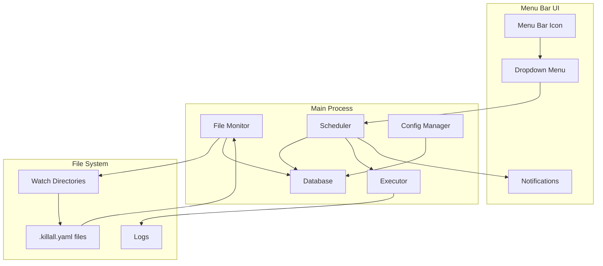

# Killall-Tofu: Technical Specification Document

## Executive Summary

Killall-Tofu is a macOS menu bar application designed to automatically destroy Terraform infrastructure after a specified timeout period. The application monitors designated directories for `.killall.yaml` configuration files, registers infrastructure for scheduled destruction, and provides a visual interface for managing active timers through the system menu bar.

### Key Features
- Automatic infrastructure discovery via file-based configuration
- Natural language timeout specification
- Visual countdown timers with warning notifications
- Centralized management through menu bar interface
- Comprehensive logging and audit trail
- Retry logic for failed destructions

## System Architecture

### 1. Technology Stack

| Component | Technology | Justification |
|-----------|------------|---------------|
| Framework | Electron v28+ | Cross-platform desktop app with native menu bar support |
| Language | TypeScript 5.0+ | Type safety and improved developer experience |
| UI Framework | React 18+ | Component-based UI for menu dropdown |
| Database | SQLite3 | Lightweight, serverless, perfect for local state |
| File Watching | Chokidar | Robust file system watching with extensive platform support |
| Process Management | Node.js child_process | Native process spawning for Terraform commands |
| Build Tool | electron-builder | Industry standard for Electron app packaging |
| Testing | Jest + Playwright | Unit and E2E testing coverage |

### 2. System Components



### 3. Data Flow

1. **Discovery Phase**
   - File Monitor scans configured directories every 30 seconds
   - Detects new `.killall.yaml` files
   - Parses configuration and validates
   - Registers project in database with calculated destroy time

2. **Scheduling Phase**
   - Scheduler maintains in-memory timer registry
   - Updates UI with current countdown states
   - Triggers notifications at warning intervals
   - Initiates destroy command at timeout

3. **Execution Phase**
   - Executor spawns Terraform process
   - Captures stdout/stderr to logs
   - Implements retry logic on failure
   - Updates database with results
   - Sends completion notification

## Configuration Management

### Directory Structure

```
~/.killall/
├── killall.yaml                   # Main application configuration
├── ignore                          # Global ignore patterns
├── killall.db                     # SQLite database
├── logs/
│   ├── app.log                   # Application log
│   ├── executions/               # Per-execution logs
│   │   └── {timestamp}-{id}.log
│   └── archive/                  # Rotated logs
└── backups/                      # Configuration backups
```

### Configuration Files

#### Main Configuration (`~/.killall/killall.yaml`)

```yaml
version: 1

scanner:
  watch_dirs:                # Directories to monitor
    - ~/terraform
    - ~/projects
    - ~/infrastructure
  interval: 30               # Scan interval (seconds)
  max_depth: 10             # Recursion depth
  follow_symlinks: false    # Symlink handling

ignore:
  patterns:                 # Ignore patterns
    - "*.tfstate*"
    - "*.tfplan"
    - ".terraform/"
    - ".terragrunt-cache/"
    - "**/.git/"
    - "**/node_modules/"
    - "**/vendor/"
  ignore_file: "ignore"     # Additional ignore file

execution:
  command_timeout: 300      # Command timeout (seconds)
  environment:              # Environment variables
    TF_IN_AUTOMATION: "true"
    TF_LOG: "ERROR"
  retry:
    enabled: true
    max_attempts: 3
    delay: 30

notifications:
  enabled: true
  warning_times: [60, 15, 5, 1]  # Minutes before destroy
  sound:
    enabled: true
    warning: "Submarine"
    destroying: "Glass"
    failed: "Basso"
    completed: "Purr"

ui:
  icon:
    style: "monochrome"
    show_count: true
  menu:
    max_recent: 5
    time_format: "relative"
    show_tags: true
  animations:
    warning_pulse: true
    destroying_spin: true

logging:
  level: "info"
  rotation:
    max_size: "10MB"
    max_files: 10
    compress: true
  execution_retention: 30

database:
  auto_vacuum: true
  vacuum_interval: 86400
  retention:
    projects: 0
    executions: 90
    events: 30

advanced:
  max_concurrent: 3
  process_priority: "normal"
```

#### Project Configuration (`.killall.yaml`)

```yaml
version: 1
timeout: "2 hours"              # Required: Natural language duration
command: "terraform destroy -auto-approve"  # Optional: Override command
name: "Development Environment"  # Optional: Display name
tags: ["dev", "aws"]           # Optional: Tags
execution:                     # Optional: Execution overrides
  timeout: 600
  environment:
    AWS_PROFILE: "dev"
hooks:                         # Optional: Pre/post hooks
  pre_destroy: []
  post_destroy: []
```

## Database Schema

### Tables

```sql
-- Projects table: Registered infrastructure
CREATE TABLE projects (
    id TEXT PRIMARY KEY,            -- UUID
    path TEXT NOT NULL UNIQUE,      -- Absolute path to project
    name TEXT,                      -- Display name
    config TEXT NOT NULL,           -- JSON configuration
    discovered_at TIMESTAMP NOT NULL,
    destroy_at TIMESTAMP NOT NULL,
    status TEXT NOT NULL CHECK(
        status IN ('active', 'pending', 'destroying', 
                  'destroyed', 'failed', 'cancelled')
    ),
    created_at TIMESTAMP DEFAULT CURRENT_TIMESTAMP,
    updated_at TIMESTAMP DEFAULT CURRENT_TIMESTAMP
);

-- Executions table: Command execution history
CREATE TABLE executions (
    id INTEGER PRIMARY KEY AUTOINCREMENT,
    project_id TEXT NOT NULL,
    command TEXT NOT NULL,
    working_dir TEXT NOT NULL,
    started_at TIMESTAMP NOT NULL,
    completed_at TIMESTAMP,
    exit_code INTEGER,
    stdout TEXT,
    stderr TEXT,
    status TEXT NOT NULL CHECK(
        status IN ('running', 'completed', 'failed', 'timeout')
    ),
    attempt_number INTEGER DEFAULT 1,
    FOREIGN KEY (project_id) REFERENCES projects(id)
);

-- Events table: Audit log
CREATE TABLE events (
    id INTEGER PRIMARY KEY AUTOINCREMENT,
    project_id TEXT,
    event_type TEXT NOT NULL CHECK(
        event_type IN ('discovered', 'registered', 'warning', 
                      'destroying', 'destroyed', 'failed', 
                      'cancelled', 'extended', 'error')
    ),
    details TEXT,  -- JSON details
    timestamp TIMESTAMP DEFAULT CURRENT_TIMESTAMP,
    FOREIGN KEY (project_id) REFERENCES projects(id)
);

-- Indexes for performance
CREATE INDEX idx_projects_status ON projects(status);
CREATE INDEX idx_projects_destroy_at ON projects(destroy_at);
CREATE INDEX idx_executions_project ON executions(project_id);
CREATE INDEX idx_events_project ON events(project_id);
CREATE INDEX idx_events_timestamp ON events(timestamp);
```

## API Interfaces

### Core Service Interfaces

```typescript
// File Watcher Service
interface FileWatcher {
  start(): Promise<void>;
  stop(): Promise<void>;
  scan(): Promise<ProjectConfig[]>;
  addWatchDir(path: string): void;
  removeWatchDir(path: string): void;
  setIgnorePatterns(patterns: string[]): void;
}

// Scheduler Service
interface Scheduler {
  register(project: Project): void;
  cancel(projectId: string): void;
  extend(projectId: string, duration: string): void;
  getActive(): Project[];
  getTimeRemaining(projectId: string): number;
}

// Executor Service  
interface Executor {
  execute(project: Project): Promise<ExecutionResult>;
  cancel(executionId: string): void;
  getRunning(): Execution[];
}

// Database Service
interface Database {
  projects: {
    create(project: Project): Promise<void>;
    update(id: string, updates: Partial<Project>): Promise<void>;
    delete(id: string): Promise<void>;
    findById(id: string): Promise<Project | null>;
    findByPath(path: string): Promise<Project | null>;
    findActive(): Promise<Project[]>;
  };
  
  executions: {
    create(execution: Execution): Promise<number>;
    update(id: number, updates: Partial<Execution>): Promise<void>;
    findByProject(projectId: string): Promise<Execution[]>;
  };
  
  events: {
    log(event: Event): Promise<void>;
    query(filters: EventFilters): Promise<Event[]>;
  };
}

// Notification Service
interface Notifier {
  notify(type: NotificationType, project: Project, details?: any): void;
  setWarningTimes(times: number[]): void;
  setSoundEnabled(enabled: boolean): void;
}
```

### Data Models

```typescript
interface Project {
  id: string;
  path: string;
  name?: string;
  config: ProjectConfig;
  discoveredAt: Date;
  destroyAt: Date;
  status: ProjectStatus;
  createdAt: Date;
  updatedAt: Date;
}

interface ProjectConfig {
  version: number;
  timeout: string;
  command?: string;
  name?: string;
  tags?: string[];
  execution?: {
    timeout?: number;
    workingDir?: string;
    environment?: Record<string, string>;
  };
  hooks?: {
    preDestroy?: string[];
    postDestroy?: string[];
  };
}

interface Execution {
  id?: number;
  projectId: string;
  command: string;
  workingDir: string;
  startedAt: Date;
  completedAt?: Date;
  exitCode?: number;
  stdout?: string;
  stderr?: string;
  status: ExecutionStatus;
  attemptNumber: number;
}

type ProjectStatus = 
  | 'active'      // Registered and waiting
  | 'pending'     // About to be destroyed
  | 'destroying'  // Currently being destroyed
  | 'destroyed'   // Successfully destroyed
  | 'failed'      // Destruction failed
  | 'cancelled';  // Cancelled by user

type ExecutionStatus = 
  | 'running'
  | 'completed'
  | 'failed'
  | 'timeout';

type NotificationType =
  | 'registered'
  | 'warning'
  | 'destroying'
  | 'destroyed'
  | 'failed'
  | 'error';
```

## User Interface

### Menu Bar States

| State | Icon | Description |
|-------|------|-------------|
| Idle | 🔥 (static) | No active projects |
| Active | 🔥 (with badge) | Projects scheduled, badge shows count |
| Warning | 🔥 (pulsing) | Project <15 min from destruction |
| Destroying | 🔥 (spinning) | Actively destroying infrastructure |
| Error | ⚠️ (red) | Recent failure requiring attention |

### Menu Structure

```
🔥 Killall-Tofu (3)
├── Active Infrastructure ─────────────
│   ├── 🟢 Dev Environment (2h 15m)
│   │   Path: ~/terraform/dev
│   │   Tags: development, aws
│   │   ├── Extend → [+15m] [+1h] [+1d]
│   │   └── Cancel Destruction
│   ├── 🟡 Staging (45m)
│   │   Path: ~/projects/staging
│   │   ├── Extend → [+15m] [+1h] [+1d]
│   │   └── Cancel Destruction
│   └── 🔴 Test Stack (5m) ⚠️
│       Path: ~/terraform/test
│       ├── Extend → [+15m] [+1h] [+1d]
│       └── Cancel Destruction
├── Recent Activity ───────────────────
│   ├── ✅ Prod Test (2h ago)
│   ├── ❌ Failed Deploy (4h ago)
│   │   └── View Logs
│   └── ✅ Dev Cleanup (6h ago)
├── ─────────────────────────────────
├── Settings
│   ├── Watch Directories...
│   ├── Ignore Patterns...
│   ├── Notifications...
│   └── View Logs
├── About Killall-Tofu
└── Quit
```

## Implementation Roadmap

### Phase 1: Foundation (Week 1-2)

| Task ID | Task | Effort | Dependencies |
|---------|------|--------|--------------|
| T1.1 | Initialize Electron TypeScript project | 4h | - |
| T1.2 | Set up menu bar application structure | 4h | T1.1 |
| T1.3 | Implement configuration management | 8h | T1.1 |
| T1.4 | Create SQLite database schema | 4h | T1.1 |
| T1.5 | Build file watcher service | 8h | T1.3 |
| T1.6 | Implement project discovery | 6h | T1.4, T1.5 |
| T1.7 | Create basic menu UI | 8h | T1.2 |
| T1.8 | Set up logging infrastructure | 4h | T1.3 |

### Phase 2: Core Functionality (Week 2-3)

| Task ID | Task | Effort | Dependencies |
|---------|------|--------|--------------|
| T2.1 | Implement scheduler service | 8h | T1.4 |
| T2.2 | Build executor service | 8h | T1.8 |
| T2.3 | Add retry logic | 4h | T2.2 |
| T2.4 | Implement notifications | 6h | T1.2 |
| T2.5 | Create countdown timers | 6h | T2.1, T1.7 |
| T2.6 | Add timer extension feature | 4h | T2.1, T2.5 |
| T2.7 | Build cancellation logic | 4h | T2.1 |
| T2.8 | Implement hooks system | 6h | T2.2 |

### Phase 3: UI Polish (Week 3-4)

| Task ID | Task | Effort | Dependencies |
|---------|------|--------|--------------|
| T3.1 | Design React menu components | 8h | T1.7 |
| T3.2 | Implement project list view | 6h | T3.1, T2.5 |
| T3.3 | Add recent activity view | 4h | T3.1 |
| T3.4 | Create settings interface | 6h | T3.1 |
| T3.5 | Implement icon animations | 4h | T1.2 |
| T3.6 | Add sound notifications | 2h | T2.4 |
| T3.7 | Build log viewer | 4h | T3.1 |

### Phase 4: Testing & Packaging (Week 4)

| Task ID | Task | Effort | Dependencies |
|---------|------|--------|--------------|
| T4.1 | Write unit tests | 8h | All Phase 2 |
| T4.2 | Create integration tests | 6h | All Phase 2 |
| T4.3 | Set up code signing | 4h | - |
| T4.4 | Configure auto-updater | 4h | T1.1 |
| T4.5 | Build DMG installer | 4h | T4.3 |
| T4.6 | Create documentation | 6h | All |
| T4.7 | Performance optimization | 6h | All |
| T4.8 | Security audit | 4h | All |

### Future Enhancements (v2)

- **Plugin Architecture**: Extensible executor system for custom commands
- **LLM Integration**: AI-powered error recovery and troubleshooting
- **Cost Tracking**: Integration with cloud cost APIs
- **Terragrunt Support**: Native support for Terragrunt workflows
- **Team Features**: Shared visibility and collaboration tools
- **Web Dashboard**: Browser-based monitoring interface
- **Mobile Notifications**: Push notifications to mobile devices
- **Backup/Restore**: Automated state backup before destruction

## Testing Strategy

### Unit Testing
- Service isolation with mocked dependencies
- Configuration parsing validation
- Timer calculation accuracy
- Database operation integrity
- Natural language duration parsing

### Integration Testing
- File system watching behavior
- Process spawning and management
- Database transaction handling
- Notification delivery
- Menu UI interactions

### End-to-End Testing
- Complete workflow from discovery to destruction
- Error recovery scenarios
- Timer extension/cancellation flows
- Multi-project management
- System resource usage

## Security Considerations

1. **Command Injection Prevention**
   - Sanitize all user inputs
   - Use parameterized commands
   - Validate configuration files

2. **File System Access**
   - Respect user permissions
   - Validate directory paths
   - Prevent directory traversal

3. **Secret Management**
   - Never log sensitive environment variables
   - Mask credentials in output
   - Secure storage of API keys

4. **Process Isolation**
   - Run terraform in isolated environment
   - Limit resource consumption
   - Handle zombie processes

## Performance Requirements

- **Startup Time**: < 2 seconds
- **Memory Usage**: < 100MB idle, < 200MB active
- **CPU Usage**: < 5% during scanning
- **File Scanning**: Handle 10,000+ files efficiently
- **UI Responsiveness**: < 100ms for user interactions
- **Database Operations**: < 50ms for queries

## Success Metrics

- **Reliability**: 99.9% successful destruction rate
- **Performance**: Sub-second UI response times
- **Usability**: < 5 clicks for common operations
- **Stability**: < 1 crash per 1000 hours of operation
- **Adoption**: Positive user feedback and feature requests

## Glossary

- **Project**: A Terraform directory with a `.killall.yaml` configuration
- **Destruction**: The process of running `terraform destroy` on infrastructure
- **Timer**: The countdown period before automatic destruction
- **Extension**: Adding additional time to a timer
- **Hook**: Pre/post commands executed around destruction
- **Watch Directory**: A directory monitored for `.killall.yaml` files